# FundVista - Mutual Fund Co-Pilot

FundVista is a full-stack mutual fund research, portfolio analysis, planning, and optimization platform for Indian retail investors. It helps users understand mutual funds in simple language, compare Direct and Regular plans, calculate hidden commission cost, analyze portfolio health, and plan long-term financial goals.

The core idea is simple:

> A small expense ratio difference can become a large wealth difference over many years. FundVista turns that hidden cost into clear rupee-based insights.

## Table of Contents

- [Project Purpose](#project-purpose)
- [Key Features](#key-features)
- [Screenshots](#screenshots)
- [System Architecture](#system-architecture)
- [User Journey Flow](#user-journey-flow)
- [Feature Flow Diagrams](#feature-flow-diagrams)
- [Database Design](#database-design)
- [API Architecture](#api-architecture)
- [Frontend Architecture](#frontend-architecture)
- [Calculation Logic](#calculation-logic)
- [AI Co-Pilot Flow](#ai-co-pilot-flow)
- [Folder Structure](#folder-structure)
- [Setup and Run](#setup-and-run)
- [Scripts](#scripts)
- [Environment Variables](#environment-variables)
- [Project Strengths](#project-strengths)
- [Limitations](#limitations)
- [Future Scope](#future-scope)

## Project Purpose

FundVista was built to solve common problems faced by mutual fund investors:

- Investors do not clearly see the long-term cost of Regular plans.
- Expense ratio differences look small as percentages.
- Users often buy many funds but still remain concentrated in the same stocks, sectors, or fund houses.
- Fund performance is often judged without checking benchmark performance.
- Switching from Regular to Direct can save money, but may involve tax, exit load, or lock-in tradeoffs.
- Financial planning tools are usually scattered across many platforms.

FundVista combines discovery, comparison, portfolio tracking, risk analysis, goal planning, tax checks, and AI explanations into one connected dashboard.

## Key Features

### Discover

| Feature | What It Does | Why It Matters |
|---|---|---|
| Explore Funds | Search, filter, sort, and inspect funds | Helps users quickly find useful funds |
| Direct vs Regular Cards | Shows both plans side by side | Makes hidden commission cost visible |
| Fund Detail Drawer | Shows overview, portfolio, benchmark, savings, and switch guidance | Gives deep fund understanding without leaving Explore |
| Fund Screener | Filters by category, risk, AUM, return, and expense ratio | Helps users shortlist funds using rules |
| AMC Analysis | Compares fund houses by AUM, fund count, cost, and returns | Helps users understand institution-level concentration |
| Market Dashboard | Shows high-level market view | Gives context before fund selection |
| Heatmap | Visual fund performance/risk view | Makes large datasets easier to scan |
| NAV History | Shows historical NAV movement | Helps understand fund behavior over time |
| Rankings | Ranks funds by useful metrics | Helps users find strong candidates quickly |

### Analyze

| Feature | What It Does | Why It Matters |
|---|---|---|
| Portfolio Builder | Adds and tracks user holdings | Creates personalized analysis |
| Portfolio Analysis | Calculates value, gain, cost, risk, and savings | Shows portfolio health in one place |
| Compare View | Compares selected funds and Direct vs Regular plans | Helps users choose better options |
| Overlap Analyzer | Finds repeated exposure across funds | Prevents false diversification |
| Sector Exposure | Shows sector-level portfolio allocation | Finds hidden sector concentration |
| Diversification Score | Grades portfolio balance | Gives simple health score and suggestions |
| Benchmark Compare | Checks alpha vs benchmark | Shows whether active fees are justified |
| Volatility Analysis | Measures drawdown, Sharpe, Sortino, and Calmar | Explains risk beyond returns |

### Plan

| Feature | What It Does | Why It Matters |
|---|---|---|
| Savings Calculator | Calculates Direct vs Regular future value | Shows long-term cost difference |
| SIP Planner | Projects monthly investment growth | Supports disciplined investing |
| SWP Calculator | Plans systematic withdrawals | Useful for retirement income |
| STP Calculator | Plans systematic transfer | Reduces market timing risk |
| Goal Planner | Calculates SIP needed for a goal | Converts goals into monthly action |
| Risk Profiler | Maps user risk comfort to allocation | Helps avoid unsuitable funds |

### Optimize

| Feature | What It Does | Why It Matters |
|---|---|---|
| Tax Calculator | Estimates STCG/LTCG impact | Avoids surprise tax cost |
| Exit Load Calculator | Estimates redemption penalty | Helps time switching decisions |
| Rebalancing View | Compares current vs target allocation | Keeps portfolio aligned with risk profile |
| Stress Test | Simulates downside scenarios | Prepares user for market corrections |
| Portfolio Alerts | Highlights portfolio issues | Acts like an automatic checklist |

### Tools

| Feature | What It Does | Why It Matters |
|---|---|---|
| XIRR Calculator | Calculates true annualized return for irregular investments | Better than simple absolute return for SIPs |
| Watchlist | Saves funds for tracking | Supports research before investment |
| Portfolio Export | Exports portfolio data | Useful for records or advisor review |
| AI Co-Pilot | Answers mutual fund questions | Makes the dashboard easier to understand |

## Screenshots

The project includes screenshots in the `screenshots/` folder.

| Screen | File |
|---|---|
| Hero and Explore | `screenshots/01-hero-explore.png` |
| Full Page | `screenshots/02-full-page.png` |
| Portfolio | `screenshots/03-portfolio.png` |
| Compare | `screenshots/04-compare.png` |
| Recommendations | `screenshots/05-recommendations.png` |
| Savings Calculator | `screenshots/06-savings-calc.png` |
| Savings Charts | `screenshots/07-savings-charts.png` |
| Mobile Explore | `screenshots/08-mobile-explore.png` |
| Mobile Funds | `screenshots/09-mobile-funds.png` |
| Mobile Portfolio | `screenshots/10-mobile-portfolio.png` |
| Mobile Savings | `screenshots/11-mobile-savings.png` |
| Desktop Hero | `screenshots/12-desktop-hero.png` |
| Desktop Explore | `screenshots/13-desktop-explore.png` |

Example:

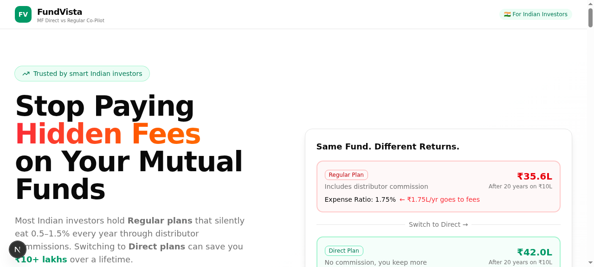

## System Architecture

FundVista uses a Next.js app with React client components, API routes, Prisma ORM, and SQLite storage.

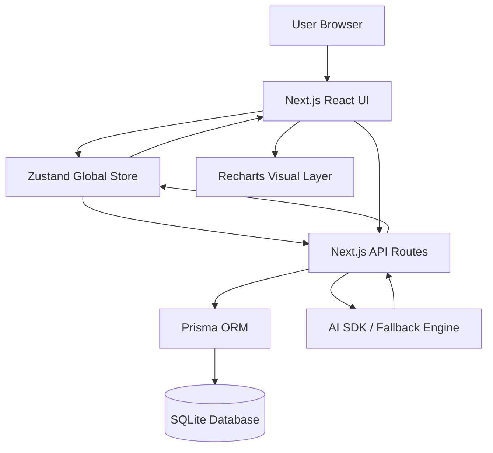

### Layer Responsibilities

| Layer | Responsibility |
|---|---|
| UI Components | Render tabs, cards, forms, charts, drawers, and calculators |
| Zustand Store | Keeps active tab, funds, holdings, watchlist, goals, comparison selection, and calculation results |
| API Routes | Perform backend calculations, CRUD operations, and AI chat calls |
| Prisma ORM | Type-safe database access |
| SQLite | Stores funds, holdings, goals, and watchlist data |
| AI Layer | Explains mutual fund concepts and answers user questions |

## User Journey Flow

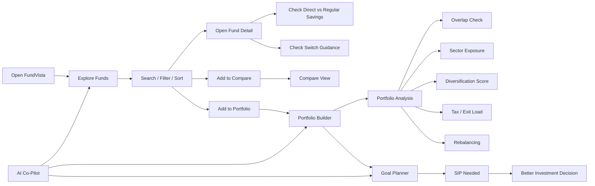

## Feature Flow Diagrams

### Explore Funds Flow

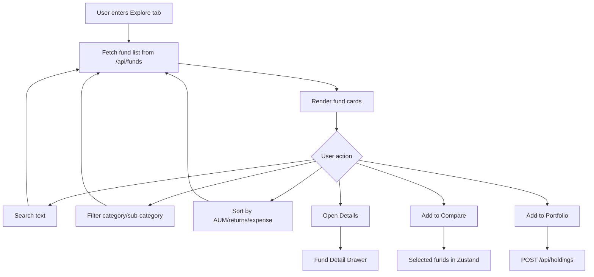

### Fund Detail Drawer Flow

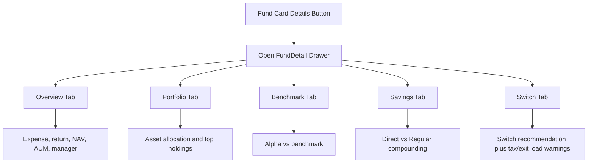

### Portfolio Analysis Flow

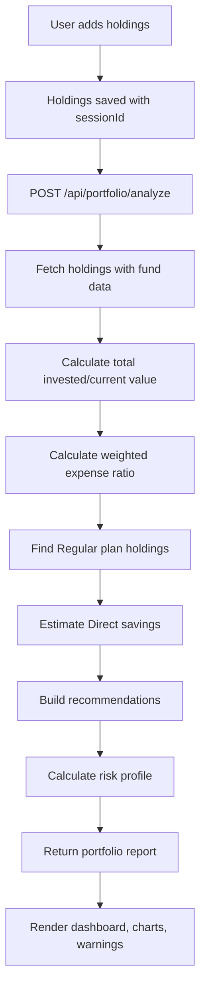

### Direct vs Regular Savings Flow

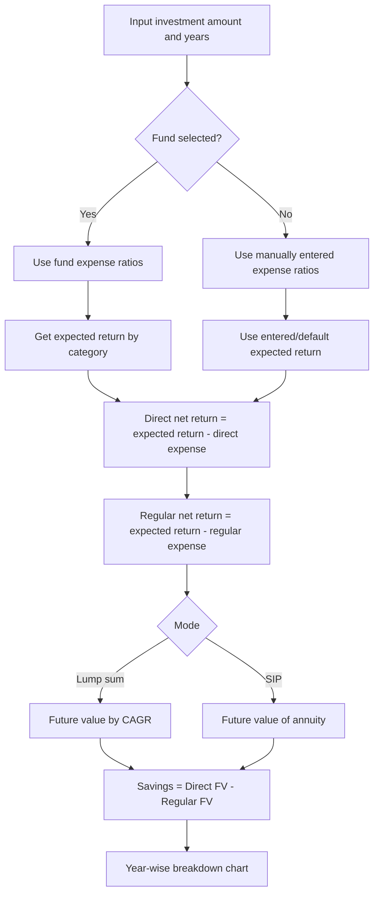

### Goal Planner Flow

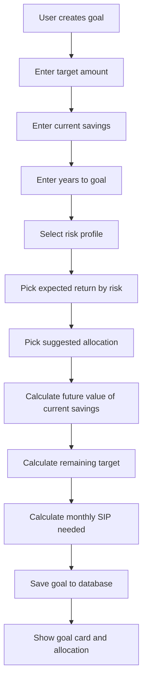

### Tax and Switch Decision Flow

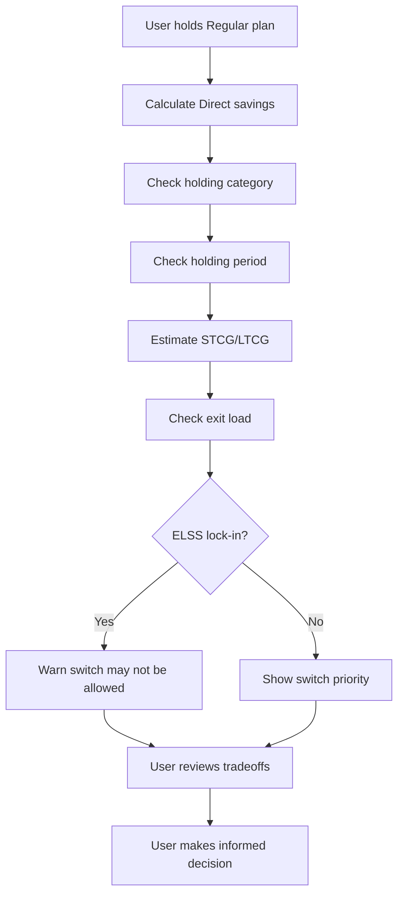

### AI Co-Pilot Flow

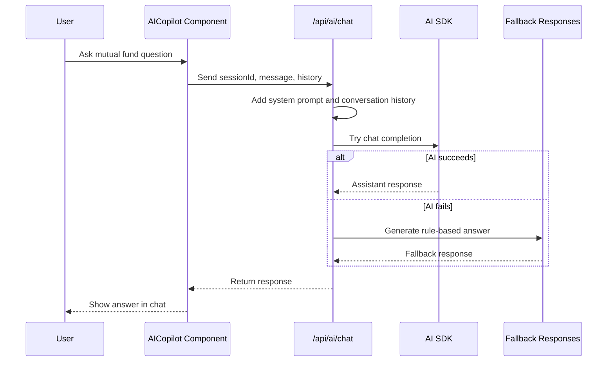

## Database Design

The Prisma schema is located at `prisma/schema.prisma`.

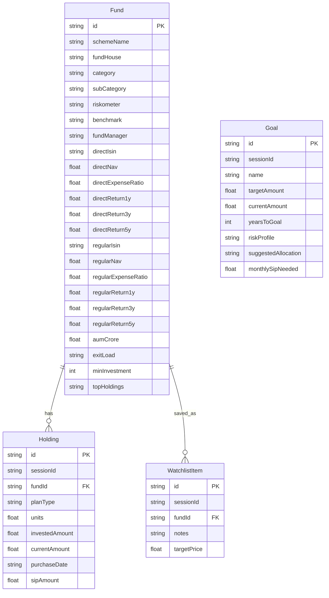

### Model Purpose

| Model | Purpose |
|---|---|
| Fund | Master mutual fund data with Direct and Regular plan fields |
| Holding | User portfolio holdings stored by browser session |
| WatchlistItem | Funds saved for tracking and research |
| Goal | User financial goals and calculated SIP requirement |

## API Architecture

The backend is implemented using Next.js API routes inside `src/app/api`.

```mermaid
flowchart TB
    API[src/app/api]
    Funds[Funds APIs]
    Portfolio[Portfolio APIs]
    Planning[Planning APIs]
    Optimize[Optimize APIs]
    AI[AI APIs]
    Watchlist[Watchlist APIs]
    Goals[Goals APIs]

    API --> Funds
    API --> Portfolio
    API --> Planning
    API --> Optimize
    API --> AI
    API --> Watchlist
    API --> Goals

    Funds --> F1[/api/funds]
    Funds --> F2[/api/funds/compare]
    Funds --> F3[/api/funds/screener]
    Funds --> F4[/api/funds/nav-history]
    Funds --> F5[/api/funds/amc]

    Portfolio --> P1[/api/holdings]
    Portfolio --> P2[/api/portfolio/analyze]
    Portfolio --> P3[/api/portfolio/overlap]
    Portfolio --> P4[/api/portfolio/sector-exposure]
    Portfolio --> P5[/api/portfolio/diversification]
    Portfolio --> P6[/api/portfolio/rebalancing]
    Portfolio --> P7[/api/portfolio/stress-test]
    Portfolio --> P8[/api/portfolio/xirr]

    Planning --> PL1[/api/savings/calculate]
    Planning --> PL2[/api/sip/planner]
    Planning --> PL3[/api/swp/calculator]
    Planning --> PL4[/api/stp/calculator]

    Optimize --> O1[/api/tax/calculate]
    AI --> A1[/api/ai/chat]
    AI --> A2[/api/ai/insights]
    Watchlist --> W1[/api/watchlist]
    Goals --> G1[/api/goals]
```

### Main API List

| Route | Purpose |
|---|---|
| `/api/funds` | Fetch funds with search, filters, sorting, and pagination |
| `/api/funds/[id]` | Fetch one fund in detail |
| `/api/funds/compare` | Compare selected funds |
| `/api/funds/amc` | AMC-level aggregation |
| `/api/funds/heatmap` | Fund heatmap data |
| `/api/funds/nav` | NAV lookup |
| `/api/funds/nav-history` | Historical NAV data |
| `/api/funds/rankings` | Fund ranking data |
| `/api/funds/screener` | Advanced screening |
| `/api/funds/volatility` | Risk and volatility metrics |
| `/api/holdings` | Create/fetch holdings |
| `/api/holdings/[id]` | Update/delete holding |
| `/api/portfolio/analyze` | Portfolio summary, cost, risk, and savings |
| `/api/portfolio/alerts` | Portfolio warnings |
| `/api/portfolio/diversification` | Diversification scoring |
| `/api/portfolio/export` | Export portfolio |
| `/api/portfolio/overlap` | Overlap analysis |
| `/api/portfolio/rebalancing` | Rebalancing suggestions |
| `/api/portfolio/sector-exposure` | Sector exposure |
| `/api/portfolio/stress-test` | Stress testing |
| `/api/portfolio/xirr` | XIRR calculation |
| `/api/goals` | Goal CRUD and SIP calculation |
| `/api/risk/profile` | Risk profile calculation |
| `/api/savings/calculate` | Direct vs Regular savings |
| `/api/sip/planner` | SIP planner |
| `/api/stp/calculator` | STP calculator |
| `/api/swp/calculator` | SWP calculator |
| `/api/tax/calculate` | Tax calculation |
| `/api/watchlist` | Watchlist CRUD |
| `/api/ai/chat` | AI chat |
| `/api/ai/insights` | AI fund insights |

## Frontend Architecture

The main frontend entry is `src/app/page.tsx`.

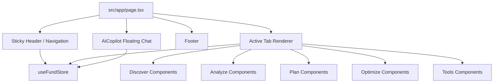

### Navigation Groups

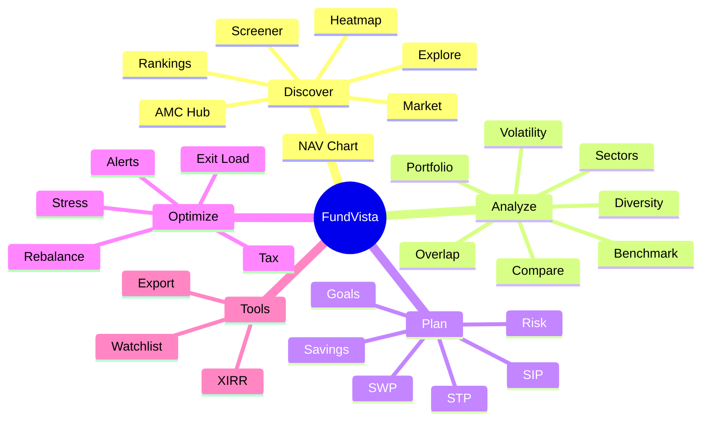

### State Store

Global app state is defined in `src/lib/store.ts`.

It stores:

- Active tab
- Fund search filters
- Fund list
- Session ID
- Holdings
- Selected comparison funds
- Portfolio analysis
- Savings calculator result
- AI insights
- Watchlist
- Goals

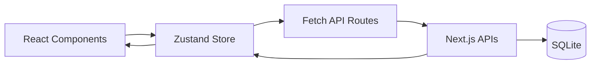

## Calculation Logic

### Direct vs Regular Compounding

Expense ratios are stored as percentages.

```text
Direct net return = Expected return - Direct expense ratio
Regular net return = Expected return - Regular expense ratio
Savings = Direct future value - Regular future value
```

Example:

```text
Expected return = 12%
Direct expense ratio = 0.50%
Regular expense ratio = 1.25%

Direct net return = 11.50%
Regular net return = 10.75%
```

The Direct plan compounds at a higher net rate, so the gap grows with time.

### Lump Sum Future Value

```text
Future Value = Investment Amount * (1 + Net Return Rate) ^ Years
```

### SIP Future Value

```text
FV = P * [((1 + r)^n - 1) / r] * (1 + r)
```

Where:

- `P` = monthly SIP amount
- `r` = monthly net return rate
- `n` = number of months

### Portfolio Weighted Expense Ratio

```text
Weighted Expense Ratio = Sum(Holding Weight * Holding Expense Ratio)
```

Where:

```text
Holding Weight = Holding Current Value / Total Portfolio Current Value
```

### Alpha

```text
Alpha = Fund Return - Benchmark Return
```

Positive alpha means the fund beat the benchmark. Negative alpha means the fund underperformed.

### XIRR

XIRR is used for portfolios with irregular cash flows. It is better than absolute return for SIPs because each investment happens on a different date.

### Goal SIP Calculation

The Goal Planner estimates monthly SIP required to reach a target corpus.

```text
Future value of current savings = Current Savings * (1 + monthly return) ^ months
Remaining target = Target Amount - Future value of current savings
Monthly SIP = Remaining target / SIP annuity factor
```

## AI Co-Pilot Flow

The AI Co-Pilot is always available as a floating assistant.

It can explain:

- Direct vs Regular plans
- Expense ratio
- SIP vs lump sum
- STCG and LTCG
- ELSS
- Riskometer
- Diversification
- Portfolio construction

The chat API keeps a short conversation history by `sessionId`. If the AI call fails, the route returns a fallback educational answer.

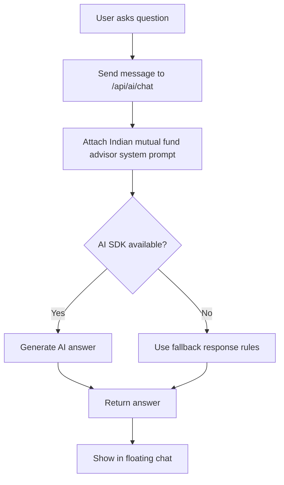

## Folder Structure

```text
.
|-- FundVista_Project_Documentation.md
|-- README.md
|-- package.json
|-- next.config.ts
|-- tailwind.config.ts
|-- prisma
|   |-- schema.prisma
|   |-- seed.ts
|   |-- fundSeed.ts
|   |-- seed-holdings.ts
|-- db
|   |-- custom.db
|-- public
|   |-- logo.svg
|   |-- robots.txt
|-- screenshots
|   |-- 01-hero-explore.png
|   |-- 02-full-page.png
|   |-- ...
|-- src
|   |-- app
|   |   |-- page.tsx
|   |   |-- layout.tsx
|   |   |-- globals.css
|   |   |-- api
|   |-- components
|   |   |-- ExploreFunds.tsx
|   |   |-- PortfolioBuilder.tsx
|   |   |-- CompareView.tsx
|   |   |-- AICopilot.tsx
|   |   |-- ui
|   |-- hooks
|   |-- lib
|       |-- db.ts
|       |-- store.ts
|       |-- helpers.ts
|       |-- utils.ts
```

## Setup and Run

### Prerequisites

- Node.js
- npm
- SQLite database file included in the project

### 1. Install dependencies

```bash
npm install
```

### 2. Configure environment

Create or update `.env`:

```env
DATABASE_URL="file:./db/custom.db"
```

### 3. Generate Prisma client

```bash
npm run db:generate
```

### 4. Push database schema if needed

```bash
npm run db:push
```

### 5. Run development server

```bash
npm run dev
```

Open:

```text
http://localhost:3000
```

### 6. Build production version

```bash
npm run build
```

### 7. Start production server

```bash
npm run start
```

## Scripts

| Script | Purpose |
|---|---|
| `npm run dev` | Start Next.js development server on port 3000 |
| `npm run build` | Build standalone production app |
| `npm run start` | Start production server |
| `npm run lint` | Run ESLint |
| `npm run db:push` | Push Prisma schema to database |
| `npm run db:generate` | Generate Prisma client |
| `npm run db:migrate` | Run Prisma migration in development |
| `npm run db:reset` | Reset Prisma migrations/database |

## Environment Variables

| Variable | Example | Purpose |
|---|---|---|
| `DATABASE_URL` | `file:./db/custom.db` | SQLite database path used by Prisma |

In production, `src/lib/db.ts` points Prisma to:

```text
file:<project-root>/db/custom.db
```

## Project Strengths

- Clear Direct vs Regular cost education
- Rich portfolio analysis tools
- Simple session-based onboarding with no login requirement
- Many calculators in one platform
- Strong visual explanation using charts
- AI assistant with fallback responses
- Prisma schema keeps data structured
- Modular component architecture
- Responsive dashboard with desktop and mobile navigation

## Limitations

- Session-based storage means data is tied to browser session unless extended with authentication.
- Some calculations depend on seeded or sample fund data.
- Real production use would need reliable live mutual fund data feeds.
- AI answers are educational and should not replace a certified financial advisor.
- Tax calculations should be verified for the user's exact situation.

## Future Scope

- User authentication
- CAS statement upload/import
- Live AMFI NAV sync
- More complete historical return dataset
- PDF portfolio report generation
- Email or WhatsApp alerts
- Broker/platform integrations
- Advanced tax harvesting workflow
- More detailed rolling returns analysis
- Advisor dashboard mode

## Final Summary

FundVista is a Mutual Fund Co-Pilot that helps Indian investors discover funds, compare Direct and Regular plans, analyze portfolio health, plan financial goals, and optimize decisions using simple explanations and visual tools.

The project is built around one practical mission:

> Help users keep more of their own money by making fees, risk, overlap, tax, and long-term compounding easy to understand.
