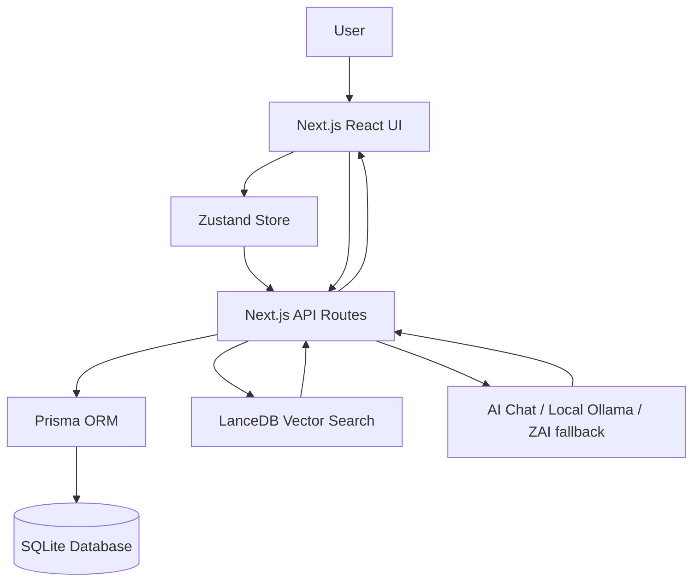

  # FundVista: Mutual Fund Co-Pilot

FundVista is an AI-powered mutual fund dashboard for Indian retail investors. It helps users understand whether they are losing money through Regular mutual fund plans, compare them with Direct plans, analyze portfolio risk, calculate tax and exit-load tradeoffs, and ask a portfolio-aware AI assistant for explanations.

The project is built for a hackathon/demo setting, but the product idea is practical: make hidden mutual fund costs visible and help investors make better, calmer decisions.

---

## 1. Problem

### Non-Technical Explanation

Many mutual fund investors in India do not know the difference between **Direct** and **Regular** plans.

Both plans usually invest in the same portfolio and are managed by the same fund manager. The difference is cost:

- **Direct plan**: lower expense ratio because there is no distributor commission.
- **Regular plan**: higher expense ratio because commission is paid to an agent/distributor.

This extra cost may look small, like 0.5% to 1.5% per year, but over 10, 20, or 30 years it compounds into lakhs of rupees.

The harder part is that switching is not always obvious. A user must also consider:

- Capital gains tax
- Exit load
- Lock-in period
- Portfolio overlap
- Risk level
- Whether the fund is actually worth holding

Most investors either ignore these details or use multiple scattered tools. FundVista brings them into one decision-making dashboard.

### Technical Explanation

The problem is a mix of financial calculation, data modeling, and user experience:

- Store mutual fund data with Direct and Regular variants.
- Track user holdings by session.
- Calculate expense-ratio leakage and future value difference.
- Estimate switching cost using tax and exit-load rules.
- Analyze portfolio health using category, sector, overlap, benchmark, and risk metrics.
- Use AI only after grounding it with portfolio and fund context.

---

## 2. Solution

### Non-Technical Explanation

FundVista acts like a mutual fund co-pilot.

Instead of only showing fund returns, it answers questions like:

- Am I holding Regular plans?
- How much money can I save by switching to Direct?
- Will tax or exit load make switching a bad idea right now?
- Is my portfolio actually diversified?
- Which funds overlap with each other?
- What should I understand before taking action?

The dashboard gives visual answers through charts, calculators, alerts, and an AI assistant.

### Technical Explanation

FundVista is a Next.js application with:

- **Next.js App Router** for frontend and backend routes.
- **React + TypeScript** for interactive UI components.
- **Tailwind CSS + shadcn/ui** for a polished dashboard interface.
- **Zustand** for client-side state management.
- **Prisma ORM + SQLite** for local structured fund and portfolio data.
- **LanceDB vector search** for semantic fund retrieval.
- **AI chat API** that combines conversation history, portfolio context, and retrieved fund context.
- **Financial calculators** for SIP, SWP, STP, XIRR, tax, exit load, savings, rebalancing, and stress testing.

---

## 3. Approach

### Product Approach

FundVista is designed around one core flow:

```text
Discover funds -> Add holdings -> Analyze portfolio -> Compare Direct vs Regular -> Get switch guidance -> Ask AI for explanation
```

The goal is not to tell users blindly what to buy. The goal is to make the hidden tradeoffs visible so the user can make an informed decision.

### Technical Approach

The app uses a hybrid architecture:

1. **Deterministic calculations for finance**

   Important numbers such as savings, tax, exit load, SIP future value, XIRR, and portfolio allocation are calculated using code, not guessed by AI.

2. **AI for explanation**

   The AI Co-Pilot explains the result in simple language. It receives the user's portfolio context and relevant fund data before answering.

3. **RAG-style fund context**

   The chat route uses semantic search through LanceDB to find relevant fund data, then attaches it to the prompt. This makes answers more specific than a generic chatbot.

4. **Session-based portfolio**

   Users can try the product without login. Holdings are linked to a session ID and stored locally through the backend database.

5. **Modular dashboard**

   Features are split into sections:

   - Discover: explore, screener, rankings, heatmap, AMC analysis
   - Analyze: portfolio, comparison, overlap, sector exposure, benchmark, volatility
   - Plan: SIP, SWP, STP, goals, risk profile
   - Optimize: tax, exit load, rebalancing, stress test, alerts
   - Tools: XIRR, watchlist, export, AI Co-Pilot

### High-Level Architecture



---

## 4. How To Run

### Prerequisites

Install these first:

- Node.js
- npm
- Git

The project already includes a local SQLite database setup.

### Step 1: Install Dependencies

```bash
npm install
```

### Step 2: Configure Environment

Create a `.env` file in the project root:

```env
DATABASE_URL="file:./db/custom.db"
```

### Step 3: Generate Prisma Client

```bash
npm run db:generate
```

### Step 4: Sync Database Schema

```bash
npm run db:push
```

### Step 5: Start The App

```bash
npm run dev
```

Open the app:

```text
http://localhost:3000
```

### Optional: Run Production Build

```bash
npm run build
npm run start
```

### Useful Scripts

| Command | Purpose |
|---|---|
| `npm run dev` | Start development server on port 3000 |
| `npm run build` | Create production build |
| `npm run start` | Start production server |
| `npm run lint` | Run ESLint |
| `npm run db:generate` | Generate Prisma client |
| `npm run db:push` | Push Prisma schema to SQLite |
| `npm run db:migrate` | Run Prisma migration |
| `npm run db:reset` | Reset database migrations |

---

## 5. What's Next

### Product Roadmap

- **CAS upload/import**: Let users upload Consolidated Account Statements and auto-build their portfolio.
- **Live AMFI NAV sync**: Keep NAV and fund data updated automatically.
- **Broker/platform integrations**: Connect with execution platforms for smoother switching.
- **PDF portfolio report**: Generate a clean advisor-style report.
- **Alerts**: Notify users about high expense ratio, overlap, manager change, underperformance, or rebalancing need.
- **Tax harvesting assistant**: Help users plan redemptions more intelligently.

### Technical Roadmap

- Add authentication so portfolios persist across devices.
- Replace sample/seeded data with production-grade data pipelines.
- Add stronger test coverage for tax, exit load, and compounding calculations.
- Improve RAG evaluation so AI answers can be measured for correctness.
- Add background jobs for NAV refresh and portfolio alerts.
- Add deployment-ready environment handling for production databases.

---

## What Judges Should Notice

FundVista is not just a chatbot and not just a calculator. It combines both:

- Calculators handle exact financial math.
- Database and APIs provide structured fund/portfolio data.
- Vector search retrieves relevant fund context.
- AI explains the result in simple investor-friendly language.
- The interface turns complex decisions into readable dashboards.

In short:

> FundVista helps Indian mutual fund investors discover hidden costs, understand risk, and make smarter Direct vs Regular plan decisions with data-backed AI guidance.

---

## Tech Stack

| Area | Technology |
|---|---|
| Frontend | Next.js, React, TypeScript |
| Styling | Tailwind CSS, shadcn/ui, Framer Motion |
| State | Zustand |
| Backend | Next.js API Routes |
| Database | SQLite |
| ORM | Prisma |
| AI | AI chat route, Ollama/local fallback, ZAI SDK |
| Retrieval | LanceDB semantic search |
| Charts | Recharts |

---

## Disclaimer

FundVista is an educational and decision-support tool. It does not provide certified financial advice. Users should verify tax and investment decisions with a qualified financial advisor before taking action.
